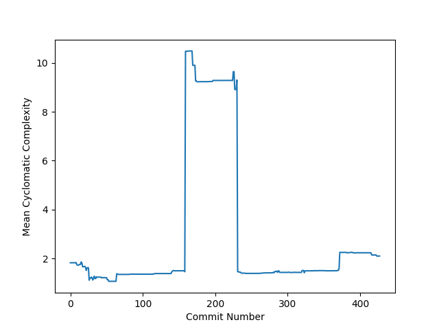

# CS7NS1 Lab 2 - Cyclomatic Code Complexity

**A REST service to calculate the cyclomatic complexity of a github repository.**

## The Project

The system uses a manager which distributes work to a set of worker nodes. The manager is a Python web application written in Flask. The worker is a normal Python program which sends http requests to the manager. The project uses the [radon library](https://github.com/rubik/radon) for Python to calculate the cyclomatic complexity. The radon github repo is also the repo being analysed by the code.

The workers use the work stealing pattern to ask for work when they're ready. They send a http `GET` request to the manager's `/work` endpoint and receive the hash of the commit they should process. They compute the cyclomatic complexity for all Python files in the repo at that commit. They then return the average complexity for that commit to the manager by sending a `POST` request back to `/work`. 

The manager gets all the commit hashes in the repository at the beginning of execution and adds them into a list of work to be done. Everytime a commit is completed it adds its complexity to a list of results and removes the commit from the work list. When all work is completed it plots a line graph of average complexity of each commit.


*Average Cyclomatic Complexity for each commit*

## Running with docker-compose

The manager and worker components each have a Dockerfile for building them and installing dependencies. I have included a `docker-compose.yml` which will start up one manager and 4 worker nodes.

**Build**:
```
docker-compose build
```

**Run**:
```
docker-compose up
```
This will start all the services and show the logs of the outputs of each service. (Things may appear slightly out of order due to the way docker interacts with python's buffered output)

or
**Run (detached):**
```
docker-compose up -d
```

**View output logs (all services)**
```
docker-compose logs -f
```

**View output logs (only the manager service)**
```
docker-compose logs -f manager
```

